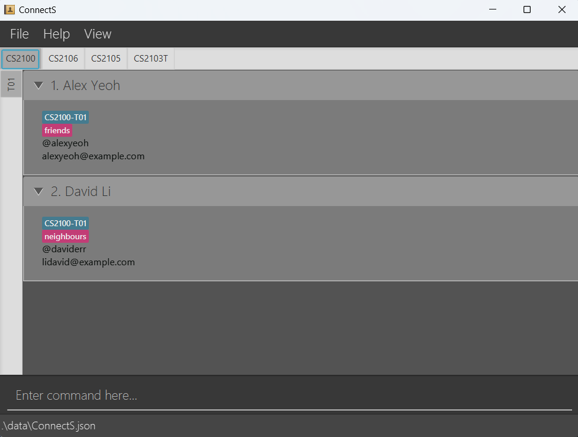
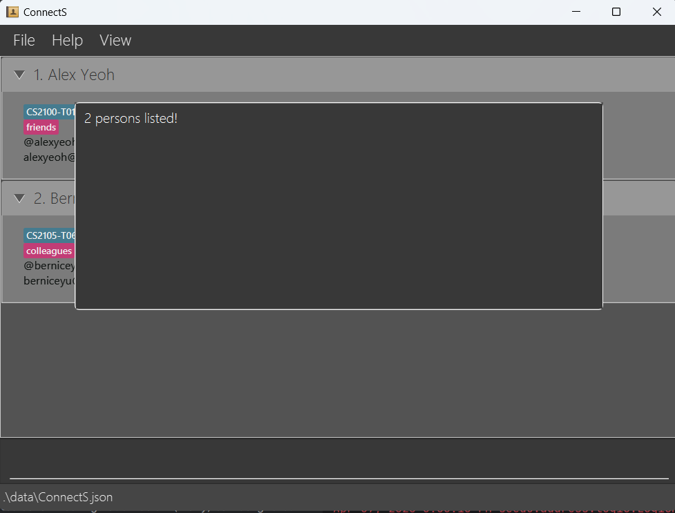
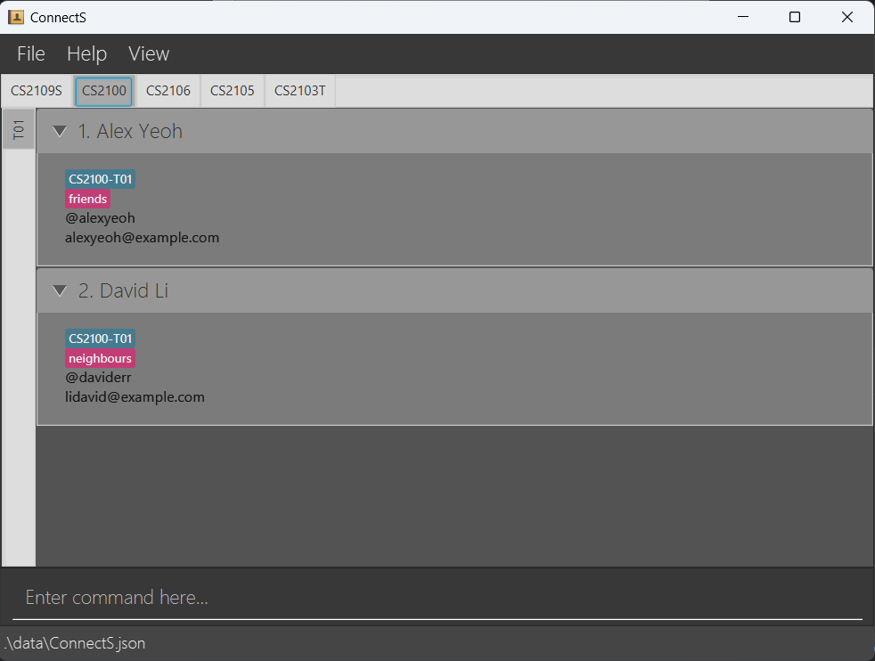

# ConnectS User Guide

**Welcome to ConnectS' user guide! As computing teaching assistants(TAs), ConnectS is your best friend in helping you
manage your tutees' contact information.**

ConnectS separates your tutee contacts into their different modules and tutorial groups, and records information you will use the most,
like telegram handles and emails.

If you are fast at typing, ConnectS' command line interface(CLI) specialisation can help you manage your tutee's 
contacts faster than other contact apps, whilst still allowing you the convenience of a graphic user interface(GUI).

<!-- * Table of Contents -->
<page-nav-print />
--------------------------------------------------------------------------------------------------------------------

## Table of contents

* [How to use this Guide](#how-to-use-this-guide)
* [Features](#features)
  * [Command Formatting](command-formatting)
  * [Parameter Formatting](parameter-formatting)
  * Commands
    * [Getting Help](#viewing-help-help)
    * [Adding a tutee](#adding-a-tutee-add)
    * [Listing all tutees](#listing-all-tutees-list)
    * [Editing a tutee](#editing-a-tutee-edit)
    * [Finding a tutee](#finding-a-tutee-find)
    * [Deleting a tutee](#deleting-a-tutee-delete)
    * [Sorting a tutee](#sorting-tutees-sort)
    * [Pinning a tutee](#pinning-a-tutee-pin-unpin)
    * [Viewing a specific module and tutorial](#viewing-a-tab-view)
    * [Clearing all tutees](#clearing-all-tutees-clear)
    * [Exiting ConnectS](#exiting-connects)
  * [Saving data](#saving-the-data)
  * [Editing save files](#editing-the-data-file)
* [FAQ](#faq)
* [Known issues](#known-issues)
* [Command Summary](#command-summary)
* [Glossary](#glossary)

--------------------------------------------------------------------------------------------------------------------

## How to use this Guide

If you are a beginner looking to get started: Visit the [Quick Start](#quick-start) section just below.

If you've already set up ConnectS, visit the [features](#features) section to see what commands are available in ConnectS.

If you are a returning user looking to refresh yourself on command formatting, visit if [command summary](#command-summary) for
a quick overview.

Confused by what certain terms mean? Visit the [glossary](#glossary).

Visit the [table](#table-of-contents) above to quickly access parts of the guide via hyperlink.

--------------------------------------------------------------------------------------------------------------------

## Quick start

1. Ensure you have Java `17` or above installed in your Computer. 

   * **For Window, Linux and Mac**: [Setup Guide](https://www3.cs.stonybrook.edu/~amione/CSE114_Course/materials/resources/InstallingJava17.pdf)

   <box type="info" seamless>
   
   **Mac users:** Ensure you have the precise JDK version prescribed [here](https://se-education.org/guides/tutorials/javaInstallationMac.html).
   </box>
   
2. Download the latest `.jar` file from [here](https://github.com/AY2425S2-CS2103T-F10-4/tp/releases/tag/v1.3).

3. Create a new folder where you want to store ConnectS, and place the `.jar` file inside.

4. Open a command terminal, `cd` into the folder you put the jar file in.
   
   * Guide to open command terminal in the `.jar` folder: 

     * **For Windows and Linux**: Navigate to the folder, then right-click in the folder and select "open in terminal" or "Open PowerShell window here"

     * **For Mac users**: [terminal guide](https://support.apple.com/en-sg/guide/terminal/trmlb20c7888/mac#:~:text=On%20your%20Mac%2C%20open%20a,window%3A%20Choose%20Open%20in%20Terminal.)
 
5. Use the `java -jar ConnectS.jar` command to run ConnectS. 
   A GUI like the image below should appear in a few seconds. Note how the app contains some sample data. 
   

6. Type the command in the command box and press Enter to execute it. e.g. typing **`help`** and pressing Enter will list all commands. 
   Some example commands you can try:

   * `list` : Lists all tutee.

   * `add n/John Doe t/@johndoe e/johnd@example.com m/CS2103T-F10` : Adds a tutee named `John Doe` to ConnectS.

   * `delete 3` : Deletes the 3rd tutee shown in the current list.

   * `view m/CS2103T-T02` : Switches the viewing tab to tutorial group T02 under module CS2103T, if it exists.

   * `exit` : Exits the app.

7.  Refer to the [features](#features) below for details of each command.

--------------------------------------------------------------------------------------------------------------------

## Features

<box type="info" seamless>

### Command formatting
**Notes about the command format:** 

* When you see a word in `UPPER_CASE`, that word is a parameter that you enter. 
  e.g. in `add n/NAME`, `NAME` is a parameter which can be used as `add n/John Doe`.

* If you see parameters in square brackets, they are optional. 
  e.g. `add [tag/TAG...]` allows for the tag parameter to be omitted.

* If you see parameters in curly brackets, you can use any combination of the parameters, but you
  must have at least one. 
  e.g. `edit INDEX {n/NAME t/TELEGRAM_HANDLE e/EMAIL}` can be used as `edit 1 n/Doe` or as `edit 2 n/Doe t/@JohnDoe` or as `edit 1 e/john@example.com`, but not `edit 1` alone.

* If you see parameters in triangle brackets, you can use any of them, but you must have only one. 
  e.g. `find <n/NAME... t/TELEGRAM_HANDLE... e/EMAIL...>` can be used as `find n/Doe` or `find t/@johndoe`, but not as `find n/Doe t/@johndoe`.

* If you see parameters with `...` after them, it means they can be used multiple times excluding zero times. 
  e.g. `m/MODULE-TUTORIAL_GROUP...` can be used as `m/CS2101-T06`, `m/CS1101S-T55 m/CS2030S-T08` etc.

* You can give parameters in any order. 
  e.g. if the command specifies `n/NAME t/TELEGRAM_HANDLE`, `t/TELEGRAM_HANDLE n/NAME` is also acceptable.

* If you type in extra lines behind commands that don't require parameters (such as `help`, `list`, `exit` and `clear`), it will be ignored. 
  e.g. if you type `help 123`, it will be interpreted as `help`.

* When you see the `MODULE-TUTORIAL_GROUP` parameter, you will need to specify both module and tutorial group of the contact, separated by a hyphen. 
  e.g. `CS2101-T01` is valid, but `CS2101 T01` is not.

* When you see a command that requires you to input the `INDEX` of a tutee, it refers to the numbering of that tutee in the
  current view you are in. 

* If you are using a PDF version of this document, be careful when copying and pasting commands as some spaces may be omitted.
</box>

<box type="info" seamless>

### Parameter formatting
**Notes about the parameter restrictions:** 

* `NAME` parameters only allow alphanumeric characters, and can have multiple words. 
   e.g. `John`, `John Doe` or `John @123` are allowed, but `John (Doe)` is not.

* `TELEGRAM_HANDLE` parameters only allow one word which must start with `@`, followed by 5 alphanumeric characters.
  `_` is allowed, but not at the start or end of the handle.  
   e.g. `@johnny` and `@john_doe` are allowed, but `johnny`, `@john` and `@_john` are not.

* `EMAIL` parameters only allow for the format `LOCAL_PART@DOMAIN`
   * `LOCAL_PART` consists of alphanumeric characters. It can also include `+` `-` `_` `.` characters, but cannot start or end with them.
   * `DOMAIN` consists of

</box>

### Viewing help : `help`

This shows you a list of commands you can use.

Format: `help`

### Adding a tutee: `add`

This allows you to add a tutee to ConnectS.

Format: `add n/NAME t/TELEGRAM_HANDLE e/EMAIL m/MODULE-TUTORIAL_GROUP... [tag/TAG...]`

<box type="tip" seamless>

**Tip:** You may add multiple module-tutorial groups to a single tutee!
</box>

Examples:
* `add n/John Doe t/@johndoey e/johnd@example.com m/CS2100-T07`
* `add n/Betsy Crowe m/CS2105-T02 t/@betsymetsy m/CS1231S-T03 e/betsycrowe@example.com`

### Listing all tutees : `list`

This shows you a list of all your tutees in ConnectS.

Format: `list`

### Editing a tutee : `edit`

This edits a contact you specify.

Format: `edit INDEX {n/NAME t/TELEGRAM_HANDLE e/EMAIL m/MODULE-TUTORIAL_GROUP... tag/TAG...}`

* Edits the tutee at the specified `INDEX`. The index refers to the index number shown in the currently displayed tutee list. The index **must be a positive integer** 1, 2, 3, …​
* At least one of the optional fields must be provided.
* Existing values will be updated to the input values.
* When editing module-tutorial groups, the existing module-tutorial groups of the tutee will be overwritten.

Examples:
*  `edit 1 t/@johndoey e/johndoe@example.com` Edits the telegram handle and email address of the 1st tutee to be `@johndoey` and `johndoe@example.com` respectively.
*  `edit 2 n/Betsy Crower` Edits the name of the 2nd tutee to be `Betsy Crower`.

### Finding a tutee: `find`

Finds tutee whose names contain any of the given keywords.

Format: `find <n/NAME_KEYWORD... t/TELEGRAM_HANDLE_KEYWORD... e/EMAIL_KEYWORD...>`

* The search is case-insensitive. e.g `hans` will match `Hans`
* The order of the keywords does not matter. e.g. `Hans Bo` will match `Bo Hans`
* Only the name, telegram handle, or email can be searched.
* Only one field can be searched at a time.
* Partial words can also be matched e.g. `Han` will match `Hans`
* Persons matching at least one keyword will be returned (i.e. `OR` search).
  e.g. `Hans Bo` or `an` will return `Hans Gruber`, `Bo Yang`

Examples:
* `find t/@joh` returns tutees with telegram handles `@johnny` and `@johseph`.
* `find n/Amy Bob` returns tutees with names `Amy Cheng` and `Bob Ross`. 
  

### Deleting a tutee : `delete`

This deletes the tutee you specify.

Format: `delete INDEX`

* Deletes the person at the specified `INDEX`.
* The index refers to the index number shown in the displayed tutee list.
* The index **must be a positive integer** 1, 2, 3, ...

Examples:
* `list` followed by `delete 2` deletes the 2nd tutee in ConnectS.
* `find Betsy` followed by `delete 1` deletes the 1st tutee in the results of the `find` command.

### Sorting tutees: `sort`

This sorts your tutees in lexicographical order.

Format: `sort`

### Pinning a tutee: `pin`, `unpin`

This pins one tutee to always show up at the top of the list, or unpins a tutee.

Format:` pin INDEX`, `unpin INDEX`

* The index refers to the index number shown in the displayed tutee list.
* The index **must be a positive integer** 1, 2, 3, ...

### Viewing a tab: `view`

This switches your view tab to a specified module and tutorial.

Format: `view m/MODULE-TUTORIAL_GROUP`

* You can also switch to a specific module and tutorial group or a view all tab using the menu buttons.
* View all tab:
  
* Viewing a specific module and tutorial tab:
  

### Clearing all tutees : `clear`

<box type="warning" seamless>

**Caution:**
This deletes all your tutees from ConnectS. 
</box>

Format: `clear`

### Exiting ConnectS: `exit`

Bye bye :).

Format: `exit`

### Saving the data

ConnectS data are saved in the hard disk automatically after any command you give that changes the data. There is no need to save manually.

### Editing the data file

ConnectS data are saved automatically as a JSON file `[JAR file location]/data/ConnectS.json`. You are welcome to update data directly by editing that data file if you're an advanced user.

<box type="warning" seamless>

**Caution:**
If your changes to the data file makes its format invalid, ConnectS will discard all data and start with an empty data file at the next run.  Hence, it is recommended to take a backup of the file before editing it. 
Furthermore, certain edits can cause the ConnectS to behave in unexpected ways (e.g., if a value entered is outside the acceptable range). Therefore, edit the data file only if you are confident that you can update it correctly.
</box>

--------------------------------------------------------------------------------------------------------------------

## FAQ

**Q**: How do I transfer my data to another Computer? 
**A**: Install the app in the other computer and overwrite the empty data file it creates with the file that contains the data of your previous ConnectS home folder.

--------------------------------------------------------------------------------------------------------------------

## Known issues

1. **When using multiple screens**, if you move the application to a secondary screen, and later switch to using only the primary screen, the GUI will open off-screen. The remedy is to delete the `preferences.json` file created by the application before running the application again.
2. **If you minimize the Help Window** and then run the `help` command (or use the `Help` menu, or the keyboard shortcut `F1`) again, the original Help Window will remain minimized, and no new Help Window will appear. The remedy is to manually restore the minimized Help Window.

--------------------------------------------------------------------------------------------------------------------

## Command summary

Action     | Format, Examples
-----------|----------------------------------------------------------------------------------------------------------------------------------------------------------------------
**Add**    | `add n/NAME t/TELEGRAM_HANDLE e/EMAIL m/MODULE-TUTORIAL_GROUP... [tag/TAG]...`   e.g., `add n/James Ho t/@jameshoho e/jamesho@example.com m/CS2030S-T08`
**Clear**  | `clear`
**Delete** | `delete INDEX`  e.g., `delete 3`
**Edit**   | `edit INDEX {n/NAME t/TELEGRAM_HANDLE e/EMAIL m/MODULE-TUTORIAL_GROUP... tag/TAG...}`  e.g.,`edit 2 n/James Lee e/jameslee@example.com`
**Find**   | `find <n/NAME... t/TELEGRAM_HANDLE... e/EMAIL...>`  e.g., `find n/James Jake`
**List**   | `list`
**Sort**   | `sort`
**Pin**    | `pin INDEX`
**View**   | `view m/MODULE-TUTORIAL_GROUP`
**Help**   | `help`

--------------------------------------------------------------------------------------------------------------------

## Glossary

Term   | Meaning
--------------------|-----------------------------------------------------------------------------------------------
**Lexicographical** | A sorting order that sorts according to the unicode of the name, i.e. numbers 0-9 come first, sorted by ascending order, then capital letters by alphabetical order, then lower case letters in alphabetical order. e.g. `Alex123`, `alex456`, `123alex` will be sorted as `123alex`, `Alex123`, `alex456`
**Module-Tutorial Group** | A input parameter that combines the module and tutorial group numbers of a contact e.g. `CS2101-T02`
**Index**| Ordering of the contacts, starting from 1
**Command Line Interface**| A texted-based user interface where the user executes functions by typing in commands.
**Graphical User Interface**| A graphics-based user interface where the user executes functions by using mouse and menus.

